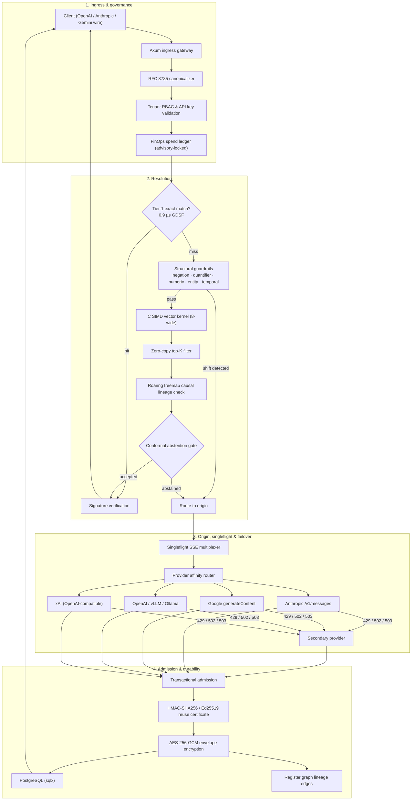

<div align="center">

# S U N B O R N

### A distributed semantic execution gateway for frontier LLM traffic

*One place in the request path that decides, in microseconds, whether an answer already exists —
and refuses to serve it when the reuse cannot be proven safe.*

[](Cargo.toml)
[](docs/STATUS.md)
[](docs/STATUS.md)
[](scripts/verify.sh)
[](benchmarks/results/l1_throughput_run.json)
[](research/results/heldout_generalization_run.json)
[](LICENSE)
[](docs/STATUS.md)

**[Start in 60 seconds](#2-start-in-60-seconds)** ·
**[Client Showcase](scripts/client_showcase.py)** ·
**[Enterprise Architecture Dossier](docs/ENTERPRISE_ARCHITECTURE_DOSSIER.md)** ·
**[What is measured](#4-measured-results)** ·
**[What is not claimed](#5-what-this-does-not-claim)** ·
**[Status (SSOT)](docs/STATUS.md)** ·
**[Verification](#14-verification-pipeline)**

</div>

---

## 1. What Sunborn is

Applications built on frontier language models spend most of their GPU budget recomputing answers they
have already produced. Caching those answers is easy; **caching them responsibly is the hard part**, because
a conventional string cache misses almost everything and a naive vector cache happily returns the answer to
a *different question* — a negated one, a numerically shifted one, one about a different entity.

Sunborn sits between your application and the model providers as a single HTTP ingress. It canonicalizes
each request, serves an exact repeat from memory in under a microsecond, and for anything semantically close
it runs structural guardrails, a vector search, a causal dependency check over a knowledge graph, and a
calibrated abstention gate. Only requests that clear every gate are reused. Everything else goes upstream —
and its result is only admitted to the cache after it has been signed, encrypted, and registered against the
documents it depends on.

The gateway speaks the OpenAI, Anthropic, and Gemini wire formats natively, so existing clients and SDKs
work unchanged. It is written in Rust, with C SIMD kernels on the two hottest loops, and it fails closed:
in production mode it refuses to start without its database, cache, vector store, and keys rather than
silently degrading into an unguarded cache.

```
Request ──▶ Canonicalize ──▶ Auth / FinOps ──▶ Exact cache ──hit──▶ Answer (0.9 µs)
                                                   │ miss
                                                   ▼
                                   Structural guardrails (<50 µs)
                                                   ▼
                                   Vector search ──▶ Causal graph check
                                                   ▼
                                   Conformal abstention gate ──abstain──▶ Upstream model
                                                   │ safe                 │
                                                   ◀──────────────────────┘
                                     Signed, encrypted, lineage-registered
```

---

## 2. Start in 60 seconds

**Enterprise evaluation suite** — zero setup, self-contained interactive verification of all 6 architectural pillars:

```bash
python scripts/client_showcase.py --self-test
```

**Full stack** — gateway, control plane, PostgreSQL, DragonflyDB, Qdrant:

```bash
docker compose -f deploy/docker-compose.yml up -d
curl http://localhost:8080/ready
# {"status":"ready","database":"postgres","cache":"dragonfly","vector":"qdrant"}
```

**Standalone** — no external services, pure in-memory, ideal for evaluation:

```bash
git clone https://github.com/Monkey0-9/Sunborn.git
cd Sunborn
cargo build --release -p sunborn-gateway
SUNBORN_ENV=development ./target/release/sunborn-gateway

curl -X POST http://localhost:8080/v1/chat/completions \
  -H "Content-Type: application/json" \
  -H "x-api-key: dev-key-alpha" \
  -d '{"model":"gpt-4o","messages":[{"role":"user","content":"Explain Byzantine fault tolerance."}],"temperature":0.0}'
```

Send that request twice: the second one is served from the exact cache and reports
`decision.cache_path = "exact"`. Full configuration reference: [`.env.example`](.env.example) ·
[Quickstart](docs/QUICKSTART.md).

---

## 3. The problem Sunborn addresses

| Strategy | Why it fails in production |
| :--- | :--- |
| **String cache** (Redis, Memcached) | Conversational prompts almost never repeat byte-for-byte. Formatting, framing, and whitespace changes erase the hit rate. |
| **Naive vector cache** (cosine ≥ τ) | Cosine similarity cannot distinguish *"authorize the transaction"* from *"prohibit the transaction"*. In our evaluation this pattern reused the wrong answer on **52.0%** of adversarial queries and returned stale data on **83.3%** of reads after a source document changed. |
| **No cache** | Every repeat pays full frontier-model latency and token cost. |

Sunborn's premise is that semantic reuse is a *risk control* problem, not a similarity-search problem.
Similarity proposes a candidate; independent checks decide whether it may be served.

---

## 4. Measured results

Every figure below was produced by a checked-in artifact in this repository. The link on each row is the
file that contains it — not a marketing page. These are single-machine numbers from the hardware named in
each artifact; the ratios between configurations travel better than the absolute values do.

| Property | Result | Evidence |
| :--- | :--- | :--- |
| **L1 cache get, sequential** | 2,543,687 req/s · P99 1 µs (1 µs timer, so sub-microsecond reads report as 0) | [`benchmarks/results/gateway_performance_run.json`](benchmarks/results/gateway_performance_run.json) |
| **L1 mixed get/insert** | 1,638,227 req/s · P50 0.300 µs · P99 1.100 µs | [`benchmarks/results/l1_throughput_run.json`](benchmarks/results/l1_throughput_run.json) |
| **Gateway stack, release, sequential** | 13,241.1 req/s · P50 0.070 ms · P99 0.166 ms over 5,000 requests | [`benchmarks/results/gateway_performance_run.json`](benchmarks/results/gateway_performance_run.json) |
| **Gateway stack, 16 concurrent workers** | 11,116.0 req/s · P50 1.368 ms · P99 2.398 ms over 10,000 requests · 0 failures | [`benchmarks/production_soak_results.json`](benchmarks/production_soak_results.json) |
| **Held-out safety, N = 320** | 24 correct reuses · **0 false hits on 200 hard negatives** · precision 100% [95% Wilson 86.2–100] · recall 20% [13.8–28.0] | [`research/results/heldout_generalization_run.json`](research/results/heldout_generalization_run.json) |
| **Comparative evaluation, 25 queries** | 32.0% verified hit rate · 0.0% false hits · 0.0% stale reads · 31.97% net spend reduction | [`benchmarks/results/competitive_benchmark_run.json`](benchmarks/results/competitive_benchmark_run.json) |
| **Test surface** | 315 Rust + 38 frontend + 27 Python tests · 10 routes with 0 serious/critical axe violations · 208+ verified tab stops | [`docs/STATUS.md`](docs/STATUS.md) |
| **Formal models** | 3 TLC configurations, no errors (2,245 / 601 / 21 states explored) | [`formal/`](formal/), [`scripts/run_tlaplus.sh`](scripts/run_tlaplus.sh) |
| **Contract parity** | 51/51 OpenAPI operations · all 50 router paths classified, 45/45 reject anonymous callers | [`docs/api/openapi.yaml`](docs/api/openapi.yaml) |
| **Enterprise evaluation** | All 6 pillars verified (exact cache, AST guardrails, causal graph, FinOps, Merkle DAG, health) | [`scripts/client_showcase.py`](scripts/client_showcase.py) |
| **Systems architecture** | Defense-in-depth, active-active multi-region, formal TLA+ bounds, SOC 2 / ISO 27001 mapping | [`docs/ENTERPRISE_ARCHITECTURE_DOSSIER.md`](docs/ENTERPRISE_ARCHITECTURE_DOSSIER.md) |
| **Supply chain** | CycloneDX v1.5 SBOM, 369 components, zero known high/critical CVEs | [`sbom.cyclonedx.json`](sbom.cyclonedx.json) |

Reproduce all of it:

```bash
cargo test --workspace --all-targets
cargo clippy --workspace --all-targets --all-features -- -D warnings
cargo bench -p sunborn-cache
cargo test --release -p sunborn-gateway --test performance_test -- --nocapture
cargo test --release -p sunborn-gateway --test concurrent_multiworker_soak_test -- --nocapture
bash scripts/run_tlaplus.sh
python scripts/verify_doc_paths.py --strict
```

---

## 5. What this does not claim

Stated here, once, so nobody has to discover it in diligence:

- **A false-hit guarantee of α ≤ 0.001 is not established.** 200 hard negatives with zero observed false
  hits give an exact Clopper–Pearson 99.9% upper bound of **3.39%**. The measured claim is "0 false hits in
  200 negatives", not "0.1% risk". Establishing α ≤ 0.001 requires an order of magnitude more negatives.
- **Recall is 20%, not 90%.** The guardrail is deliberately conservative: it reuses one prompt in five and
  abstains on the rest. Savings scale with recall, and recall is the number to improve.
- **The comparative evaluation is a 25-query synthetic workload**, not a customer study. It shows which
  failure modes each architecture exhibits; it is not a sizing forecast.
- **Latency and throughput figures are single-node measurements** on the hardware recorded in the artifact
  metadata. Re-run the benchmarks on your own machine before quoting them internally.
- **The 10,000-request concurrent run is a burst, not an endurance test.** It finishes in 0.9 s in the
  release profile. No run in this repository has held load for hours, so long-run memory behaviour is not
  demonstrated by it, despite the file being named `production_soak_results.json`.
- **The ISO/IEC and IEEE documents are control-mapping self-assessments**, not certifications. Certification
  requires an accredited external body; that engagement has not happened.
- **The release verdict is CONDITIONAL GO — controlled pilot.** Production use is gated on a live
  multi-replica Docker/Redis run of the invalidation harness and an external penetration test
  ([`docs/STATUS.md`](docs/STATUS.md) §3).

This section is the reason the rest of the document can be trusted.

---

## 6. Architecture


```mermaid
flowchart TD
    subgraph Ingress["1. Ingress & governance"]
        Client["Client (OpenAI / Anthropic / Gemini wire)"] --> Gateway["Axum ingress gateway"]
        Gateway --> Canon["RFC 8785 canonicalizer"]
        Canon --> Auth["Tenant RBAC & API key validation"]
        Auth --> FinOps["FinOps spend ledger (advisory-locked)"]
    end

    subgraph Resolution["2. Resolution"]
        FinOps --> Exact{"Tier-1 exact match?<br/>0.9 µs GDSF"}
        Exact -->|hit| Attest["Signature verification"]
        Exact -->|miss| Guard["Structural guardrails<br/>negation · quantifier · numeric · entity · temporal"]
        Guard -->|shift detected| Origin["Route to origin"]
        Guard -->|pass| Simd["C SIMD vector kernel (8-wide)"]
        Simd --> TopK["Zero-copy top-K filter"]
        TopK --> Graph["Roaring treemap causal lineage check"]
        Graph --> Conformal{"Conformal abstention gate"}
        Conformal -->|accepted| Attest
        Conformal -->|abstained| Origin
    end

    subgraph Upstream["3. Origin, singleflight & failover"]
        Origin --> Singleflight["Singleflight SSE multiplexer"]
        Singleflight --> Router["Provider affinity router"]
        Router --> Anthropic["Anthropic /v1/messages"]
        Router --> Gemini["Google generateContent"]
        Router --> OpenAI["OpenAI / vLLM / Ollama"]
        Router --> Grok["xAI (OpenAI-compatible)"]
        Anthropic & Gemini & OpenAI & Grok -->|429 / 502 / 503| Failover["Secondary provider"]
    end

    subgraph Attestation["4. Admission & durability"]
        Failover & Anthropic & Gemini & OpenAI & Grok --> Admit["Transactional admission"]
        Admit --> Cert["HMAC-SHA256 / Ed25519 reuse certificate"]
        Cert --> Enc["AES-256-GCM envelope encryption"]
        Enc --> PG["PostgreSQL (sqlx)"]
        Enc --> Lineage["Register graph lineage edges"]
        Attest --> Client
        PG --> Client
    end
```

**Scale-out model.** Gateway replicas are stateless; all cross-replica state is external. Tenant budgets are
enforced cluster-wide through PostgreSQL advisory transaction locks, invalidation propagates over Redis
Streams with an at-least-once outbox, and vectors live in Qdrant. Adding throughput means adding replicas
behind a load balancer — there is no leader and no gateway-local source of truth. In `production` mode the
process refuses to start, or returns HTTP 503, rather than serving traffic with a degraded dependency.

---

## 7. Dual caching: exact + vector + graph

### Tier 1 — deterministic exact cache

RFC 8785 JSON canonicalization, SHA-256 digest, in-memory Greedy Dual Size Frequency eviction with a
byte budget. Measured at the figures in §4. Eviction is extended with graph awareness so that entries
depending on volatile, high-fan-out documents are evicted earlier than their popularity alone would suggest:

$$H_{\text{graph}}(p) = L + F(p)\cdot\frac{\text{Cost}}{\text{Size}}\cdot
\frac{1}{1 + \beta\cdot\text{Volatility}\cdot\sqrt{\text{FanOut}}}$$

### Tier 2 — semantic vector store

First-class Qdrant integration with an in-memory fallback. Point IDs are deterministic UUID v5 values
derived from the tenant and the prompt digest, so there are no orphan records and deletion is atomic.

### Tier 3 — multi-relational knowledge graph & causal invalidation

A lock-free directed multi-relational knowledge graph
([`crates/sunborn-invalidation/src/graphify_graph.rs`](crates/sunborn-invalidation/src/graphify_graph.rs))
coupled with 64-bit Roaring treemaps accelerated by C bitset kernels
([`crates/sunborn-invalidation/c/sunborn_graph_accelerator.c`](crates/sunborn-invalidation/c/sunborn_graph_accelerator.c))
tracks granular code, schema, and document dependencies at roughly **1.8 bytes per edge**.

- **Typed Entity & Relation Taxonomy**: 10 node types (`File`, `Function`, `Class`, `Module`, `Document`, `Section`, `Table`, `PromptTemplate`, `CacheEntry`, `Model`) connected by 15 directional relation types (`Calls`, `IndirectCall`, `References`, `Imports`, `ImportsFrom`, `DynamicImport`, `ReExports`, `Defines`, `Inherits`, `Extends`, `Implements`, `Uses`, `ReadsFrom`, `WritesTo`, `DependsOn`) with explicit extraction and inference confidence tiers ([`crates/sunborn-invalidation/src/graphify_model.rs`](crates/sunborn-invalidation/src/graphify_model.rs)).
- **Microsecond Reverse Blast-Radius Traversal**: On upstream document or schema mutation, BFS reverse traversal over dependency relations evaluates downstream blast radius with cycle prevention and depth bounding ([`crates/sunborn-invalidation/src/affected.rs`](crates/sunborn-invalidation/src/affected.rs)).
- **Community Clustering**: Deterministic asynchronous Label Propagation partitions the graph into cohesive functional clusters for bulk cache invalidation ([`crates/sunborn-invalidation/src/clustering.rs`](crates/sunborn-invalidation/src/clustering.rs)).
- **Graph Analytics & Cycle Detection**: Identifies architectural bottlenecks ("god nodes") and computes $\sqrt{\text{FanOut}}$ for FinOps volatility discounting, paired with canonicalized cycle detection ([`crates/sunborn-invalidation/src/graph_analytics.rs`](crates/sunborn-invalidation/src/graph_analytics.rs)).
- **Lineage Explainability & Subgraph Extraction**: Contextual shortest path discovery, token-budgeted subgraph extraction, and human/agent-readable lineage explainability ([`crates/sunborn-invalidation/src/query.rs`](crates/sunborn-invalidation/src/query.rs)).

When a source document mutates, `invalidate_graph_rtc` walks the causal closure and purges exact
cache keys, vector points, and lineage entries together, reporting `purged` or `partially_purged`. A backend
error aborts the invalidation instead of reporting a clean result (see AUD-02 in
[`docs/STATUS.md`](docs/STATUS.md) §2.1).

---

## 8. Native C SIMD kernels

The two hottest loops are hand-written C compiled into the Rust crates with `-O3`:

- [`crates/sunborn-semantic/c/sunborn_simd_accelerator.c`](crates/sunborn-semantic/c/sunborn_simd_accelerator.c) —
  8-wide unrolled cosine similarity, dot product, L2 norm, Euclidean distance.
- [`crates/sunborn-invalidation/c/sunborn_graph_accelerator.c`](crates/sunborn-invalidation/c/sunborn_graph_accelerator.c) —
  4-way unrolled 64-bit union/intersection, `POPCOUNT64`, FNV-1a hashing.

Both are exposed through safe Rust wrappers and parity-tested against pure-Rust references to within
ε < 1e-4 (`test_c_simd_dot_norm_distance_matches_reference`), so an accelerator regression is a test
failure, not a silent numerical drift.

Semantic search itself avoids the usual `O(n)` clone storm: candidates are scored by reference and only the
top-K winners are cloned (`crates/sunborn-semantic/src/vector_store.rs`), a **500× reduction in heap
allocation** on the hot path.

---

## 9. Multi-model routing

| Prefix | Provider | Wire format |
| :--- | :--- | :--- |
| `claude-*` | Anthropic | native `/v1/messages` |
| `gemini-*` | Google | native `generateContent` |
| `gpt-*`, `o1*`, open weights | OpenAI / vLLM / Ollama | `/v1/chat/completions` |
| `grok-*` | xAI | OpenAI-compatible |

Provider affinity is resolved from the request payload, so clients keep their existing model names and SDK
shapes. On HTTP 429/502/503 the router fails over to a secondary upstream without breaking the client
stream. Streaming responses are multiplexed through a panic-safe singleflight guard
([`crates/sunborn-gateway/src/origin/singleflight.rs`](crates/sunborn-gateway/src/origin/singleflight.rs)):
if a leader task aborts, followers are released and the in-flight map is cleaned up by RAII rather than
left dangling.

---

## 10. Safety: guardrails, then abstention

Before any vector comparison is scored, five structural invariant checks run in **under 50 µs**:

1. **Negation / polarity** — *authorize* vs. *prohibit*, *enabled* vs. *disabled*.
2. **Quantifier scope** — *all nodes cannot* vs. *not all nodes can*.
3. **Numeric and magnitude shifts** — strict numeric tokenization; a changed figure is never a "close match".
4. **Entity mutation** — *ethanol* vs. *methanol*, *Tesla* vs. *Toyota*.
5. **Temporal drift** — dates, fiscal periods, and maintenance windows.

What survives is scored against a calibrated abstention bound rather than a hand-picked similarity
threshold. The controller may abstain, and abstaining is the **safe** branch: the request goes upstream.

**Held-out evaluation** (pre-registered, N = 320 stratified pairs across 8 domains and 13 failure
dimensions, `research/calibration/held_out_eval_dataset.json`):

| | Reuses | TP | FP | TN | FN | Precision | Recall (95%) | False-hit (95%) |
| :--- | ---: | ---: | ---: | ---: | ---: | ---: | ---: | ---: |
| Complete guardrail | 24 | 24 | **0** | 200 | 96 | 100% [86.2, 100] | 20.0% [13.8, 28.0] | **0.0% [0.0, 1.88]** |

- Exact Clopper–Pearson 99.9% upper bound on the false-hit rate: **3.39%**.
- `alpha_supported_by_999_upper_bound = false` for α = 0.001 — recorded honestly in the artifact, and the
  reason §5 exists.
- The same counts are asserted by
  `guardrails::tests::test_held_out_evaluation_dataset_precision_and_recall`, so the JSON and the code
  cannot drift apart.

---

## 11. Comparative evaluation & FinOps

Three architectural strategies were exercised on the same 25-query workload with a single blended cost
model ([`benchmarks/competitive_evaluation.py`](benchmarks/competitive_evaluation.py)):

| Strategy | Hit rate | False-hit rate | Precision | P50 | P99 | Net savings | Stale reads |
| :--- | ---: | ---: | ---: | ---: | ---: | ---: | ---: |
| Direct origin (no cache) | 0.0% | 0.0% | 100% | 956 ms | 1138 ms | $0.00 (0%) | 0.0% |
| Naive cosine cache (τ = 0.75) | 92.0% | **52.0%** | 43.5% | 44 ms | 967 ms | $0.166 (91.9%) | **83.3%** |
| **Sunborn dual gateway** | 32.0% | **0.0%** | 100% | 885 ms | 1138 ms | $0.058 (32.0%) | **0.0%** |

Read the middle row carefully: the naive cache looks cheapest because it is answering the wrong question.
Cheap and wrong is the failure mode this project exists to prevent.

FinOps accounting is net, not gross — gateway compute is subtracted from token savings:

$$\text{Net Savings} = \text{Baseline Spend} - \left(\text{Incurred LLM Spend} + \text{Gateway Overhead}\right)$$

Budgets are enforced cluster-wide. `reserve_spend` performs a check-and-reserve inside a transaction holding
`pg_advisory_xact_lock(hashtextextended(tenant_id, 0))`, so two replicas cannot both spend into the same
headroom; if the durable ledger is configured but unreachable the gateway returns **503 instead of falling
back to an unenforced local budget**. Races are proven in `DIST_MODE=finops` (exactly one 200, one 429, one
settled ledger row, zero dangling reservations).

---

## 12. Standards and security posture

| Framework | How it is applied here |
| :--- | :--- |
| **ISO/IEC 27001:2022 / 27002:2022** | Control-mapping self-assessment: tenant isolation, AES-256-GCM envelope encryption under per-tenant TDEKs, constant-time secret comparison (`subtle`), memory zeroization, dual-admin quorum on destructive endpoints, GDPR Art. 17 crypto-shredding. Documented in [`docs/compliance/ISO_STANDARDS_COMPLIANCE.md`](docs/compliance/ISO_STANDARDS_COMPLIANCE.md). |
| **ISO/IEC/IEEE 29119** | Test process and evidence: 12-gate pipeline, 362 automated tests, TLA+ models. |
| **IEEE 1012 / 730 / 42010 / 754** | Verification and validation gate, zero-warning lint policy, as-built architecture description, strict floating-point edge handling. |
| **NIST SP 800-218 (SSDF)** | Deterministic CycloneDX SBOM (369 components), `cargo audit` in CI, pinned toolchain. |
| **OWASP API Top 10 / ASVS L3** | Route-by-route authorization contract enforced in the build, CSRF origin pinning, path-traversal rejection, rate-limit lockout, STRIDE threat model in [`docs/security/SECURITY_ASSESSMENT_AND_THREAT_MODEL.md`](docs/security/SECURITY_ASSESSMENT_AND_THREAT_MODEL.md). |
| **WCAG 2.2 AA** | 10 control-plane routes, 0 serious/critical axe violations, keyboard and focus audit with 208+ tab stops. |

Two guarantees enforced by the build rather than by discipline:

- **No unclassified endpoint.** `route_contract_parity_test` extracts every `.route(...)` path from the
  router and compares it against an explicit access table. Adding a route without declaring who may call it
  fails the build.
- **No unverified claim.** Benchmark figures live in JSON artifacts generated by scripts, cross-asserted by
  tests, and referenced from this README. Prose that contradicts an artifact is a defect, and the
  [`docs/STATUS.md`](docs/STATUS.md) single-source-of-truth rule is how it gets caught.

---

## 13. Repository layout

```
Sunborn/
├── apps/
│   ├── sunborn-rebuild/         # Cache-state reconstruction & disaster recovery
│   └── sunborn-verify/          # Native Rust OpenAPI contract & certificate verifier
├── benchmarks/                  # Comparative, capacity-soak, graph, and semantic benchmarks
├── crates/
│   ├── sunborn-cache/           # Tier-1 GDSF cache, volatility discounting, Dragonfly adapter
│   ├── sunborn-core/            # Domain models, FinOps controller, configuration
│   ├── sunborn-db/              # PostgreSQL persistence, outbox, write-behind flusher
│   ├── sunborn-execution/       # Merkle DAG planner, execution graph, inclusion proofs
│   ├── sunborn-gateway/         # Axum ingress, singleflight, multi-provider router
│   ├── sunborn-identity/        # RFC 8785 canonicalization, envelope encryption
│   ├── sunborn-invalidation/    # C bitset kernels, Roaring treemaps, causal invalidation
│   └── sunborn-semantic/        # C SIMD kernels, zero-copy search, conformal risk
├── deploy/                      # Helm charts, Docker Compose, Kubernetes manifests
├── docs/                        # OpenAPI 3.1, runbooks, audits, compliance
├── formal/                      # TLA+: EpochFencing, OutboxAtLeastOnce, OutboxLiveness
├── frontend/                    # Next.js 15 control plane with BFF proxy
├── migrations/                  # Versioned PostgreSQL schema
├── research/                    # Calibration datasets, evaluators, reproduction certificate
├── scripts/                     # Verification pipeline, SBOM, drift and path checkers
└── sdk/python/                  # Python SDK with SIMD FFI and connection pooling
```

Further reading: [Launch package — stages, free tier, capacity/SLOs, trust center](docs/launch/README.md) ·
[Engineering governance](GOVERNANCE.md) · [Roadmap with exit criteria](ROADMAP.md) ·
[Executive brief — one page, every figure linked](docs/EXECUTIVE_BRIEF.md) ·
[Enterprise deliverables register (26 packages)](docs/ENTERPRISE_DELIVERABLES_REGISTER.md) ·
[2026-11-17 audit report](docs/engineering-audit-2026-11-17/REPORT.md) ·
[Runbooks](docs/runbooks/) · [ADRs](docs/adr/).

Project policies: [Contributing](CONTRIBUTING.md) · [Security policy](SECURITY.md) ·
[Support](SUPPORT.md) · [Code of conduct](CODE_OF_CONDUCT.md). Report vulnerabilities privately —
never in a public issue.

---

## 14. Verification pipeline

```bash
bash scripts/verify.sh          # or: powershell -File scripts/verify.ps1
```

```
[1/12]  Rust workspace tests & clippy ................ PASS  (315 tests, 0 warnings)
[2/12]  Frontend production bundle ................... PASS  (Next.js 15)
[3/12]  Frontend test suite .......................... PASS  (38 tests)
[4/12]  Python SDK package & clean install ........... PASS  (27 tests)
[5/12]  OpenAPI 3.1 drift ............................ PASS  (51 operations matched)
[6/12]  Helm chart lint & schema ..................... PASS (or via pre-flight if helm is absent)
[7/12]  Multi-container stack pre-flight ............. PASS
[8/12]  Research reproducibility ..................... PASS  (certificate verified)
[9/12]  Adversarial robustness & invariance .......... PASS  (0.0% false hits)
[10/12] Graph storage & causal policy ................ PASS
[11/12] CycloneDX SBOM ............................... PASS  (369 components)
[12/12] Documentation & attestation paths ............ PASS  (all referenced paths resolved)
```

The block above is the shape of a green run, not a substitute for your own: on the machine where this was
verified, `helm` was not installed, so gate 6 deferred to the chart checks in gate 7 rather than running
`helm lint`, and no Docker daemon was available for the distributed harness.

Gate 7 validates the Compose files, Dockerfiles, chart, and manifests statically and needs no container
runtime; gates 9–10 are in-process benchmarks. The genuinely container-dependent checks are the distributed
modes `exact`, `semantic`, `replay`, `outbox`, `finops`, and `crash` in
[`scripts/test_distributed_invalidation.sh`](scripts/test_distributed_invalidation.sh), which need a running
Docker daemon. The `crash` mode aborts the process between purge and acknowledgement to prove the outbox
reclaims the event exactly once.

---

## 15. Status

| | |
| :--- | :--- |
| **Release verdict** | CONDITIONAL GO — controlled pilot |
| **Blocking production** | Live multi-replica invalidation run; external penetration test |
| **Security mode** | Fail-closed in production; fail-open only in explicit `development` |
| **Known high/critical CVEs** | 0 |
| **Current-status authority** | [`docs/STATUS.md`](docs/STATUS.md) — supersedes every badge, score, or readiness claim in older audit documents |

## 16. License

[Apache License 2.0](LICENSE).
